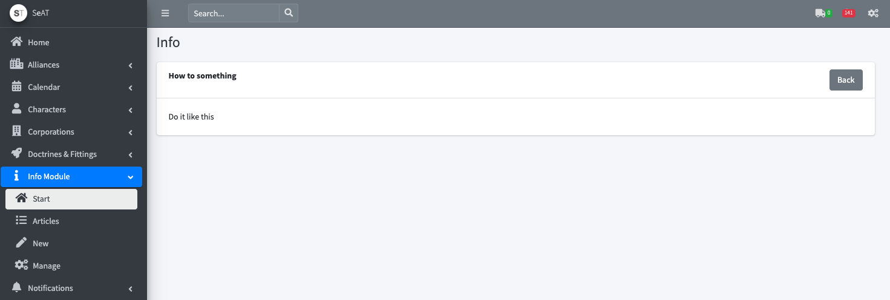

# SeAT-Info
SeAT-Info is a SeAT module that adds a small article systems for example as a corporation bulletin, or for explanations
on how to use seat.



## Usage
### Roles
#### View Role
Allows you to view articles and adds the `Start` and `Articles` page to the sidemenu.
#### Edit Role
This role allows you to create, manage and delete articles aswell as to upload images and other resources usable in the 
articles.

### Editor
The editor supports a markup language that's kinda close to HTML, but not quite. Currently, the parser is relatively 
strict, and for example you can't have spaces in the tags where there doesn't need to be one. E.g. `<a></a>` is valid, 
but `< a ></ a>` isn't.

For all available tags, please see the [documentation](documentation.md)

Currrently there are a lot of features missing that might be useful, and it could use some QOL updates. If you have 
specific needs, open an issue or pull request.

## Installation
I can also recommend reading through the [official seat documentation](https://eveseat.github.io/docs/community_packages/).

### Docker Install

Open your .env file and edit the SEAT_PLUGINS variable to include the package.

```
# SeAT Plugins
SEAT_PLUGINS=recursivetree/seat-info
```

Now run
```
docker-compose up
```
and the plugin should be installed

### Barebone Install

In your seat directory:

```
sudo -H -u www-data bash -c 'php artisan down'
sudo -H -u www-data bash -c 'composer require recursivetree/seat-info'
sudo -H -u www-data bash -c 'php artisan vendor:publish --force --all'
sudo -H -u www-data bash -c 'php artisan migrate'
sudo -H -u www-data bash -c 'php artisan seat:cache:clear'
sudo -H -u www-data bash -c 'php artisan up'
```

This should do it according to the official documentation, but I had to run the following after `sudo -H -u www-data bash -c 'php artisan seat:cache:clear` to get it working:
```
sudo -H -u www-data bash -c 'php artisan config:cache'
sudo -H -u www-data bash -c 'php artisan route:cache'
```

